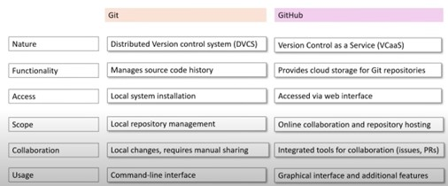

# GitHub Foundation exam

## Version control systems (VCS) are designed to track changes or revisions of code

**Benefits include:**
- Full local history and complete a copy of the repo locally.
- Straightforward and efficient branching and merging 
- Better performance, Improved fault tolerance 
- Flexible workflows
- Work fully offline 

## Git is a distributed version control system (DVCS) created by Linus Torvald

## Git commands overview

## Version control system(VCS)

**Version control systems are fully managed cloud services that host your version-controlled repositories. These services often have additional functionality beyond being a remote host for your repos. Git is the most popular and often the only choice for VCS. Often, we call these git providers.**

Example of git providers 
-	GitHub
-	Gitlab
-	Bitbucket
-	Source forge

## GitHub 

GitHub is a version control service that initially offered to host managed remote git repositories and has expanded to provide other offerings around hosted codebases. 

## Git vs Github

## Git Repo

**A GitHub repo is your git repo that you push upstream to GitHub.** 

GitHub allows you to access and manage your git repo with several 
functionalities. 

Feature of GitHub repositories
-	View different branches.
-	View tags
-	View commit history 
-	Explore the repo’s files.
-	View releases
-	See codebase language breakdown. 
-	View top-level markdown files. E.g Readme.md, Licence.md
-	You can perform actions such as Pinning, watching, forking, starring, and cloning. 

